# Ethereum & DeFi for JS/TS developer
### ARTEM VOROBEV 
*1inch Network*

---
# Цель доклада:
## • Разобраться что такое и как устроен DeFi & Ethereum
## • Пощупать инструменты руками ????
## • Закодить первую приложуху

---
# Обо мне и 1inch Network
## • Разрабатываю под Ethereum 4ре года
## • Попал в Ethereum через ETH Global хакатоны
## • 1inch Network - хакатон проект который смог
## • 1inch Network - Google flight для обмена криптовалюты
## • 70% трафика
## • Daily Volime

---
# Это может быть интересно, потому что в DeFi:
## • Работа с финансами идет в permissionless экосистеме
## • Разработчики это ключевые лица
## • Высокая зарплата и еще большая личная ответсвенность
---

## 
---
# Quick intro в Ethereum и DeFi
---
# Концепт Ethereum — виртуальная машина поверх блокчейна
## 1. Транзакции запускают код в машине 
## 2. Код меняет `state` машины
## 3. `state` хранит что угодно

---
# Ethereum — за все надо платить эфиром
## 1. `MOV ADD XOR AND ...` у всего есть цена в `Gas Units`
## 2. Лимит элементарных операций на тразакцию и блок
## 3. Концепт газа: `Gas Units * Gas Price` (п)
---
+ Газ прайс - наглядность (приложить дорогую транзакцию) и Yellow paper
---
# Смарт контракт
## • В вирутальную машину можно деплоить программы
## • Программа = `исполняемый код + состояние`
## • Это и есть смарт контракт
---
# Код это закон
## • Программа делает только-то, что в ней запрограммировано
## • Прогамму можно верефицировать - скомпилировать исходный код и сравнить
## • Пример, контракт токена [WBTC](https://etherscan.io/address/0x2260fac5e5542a773aa44fbcfedf7c193bc2c599#code)
---
# А как изменить код контракта?
---

---
# Можно:
## • Использовать `Proxy` паттерн
## • Написать `Upgradable` контракт
## • Или даже вызвать деструктор (`selfdestuct`)
## • Примеры [OpenZeppelin](https://docs.openzeppelin.com/upgrades-plugins/1.x/proxies)
---
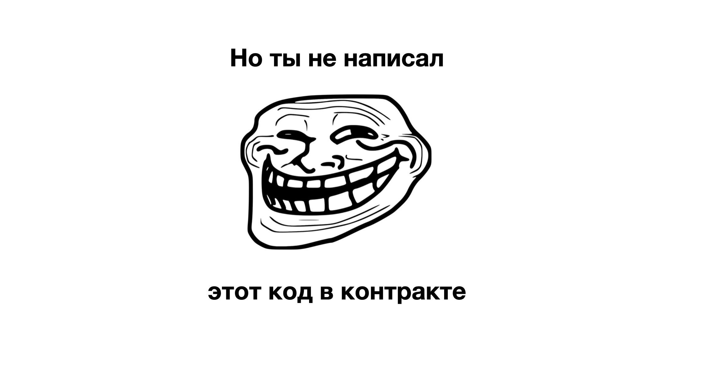

---
# И это даже хорошо
## • Код это закон
## • Вопрос доверия
---

# А как понять что контракт обновили ?

---
# А как понять что контракт обновили ?
## • Очень просто, у нас же блокчейн
## • Можно найти на [etherscan](https://etherscan.io/address/0xa0b86991c6218b36c1d19d4a2e9eb0ce3606eb48)

---
# Если провести аналогию блокчейн и Git:
## • Транзакции — коммиты
## • Блоки — merge pull request'а в мастер
## • У вас нет прав на мастер 🙂
## • Контракт и транзакции останутся в истории навсегда

---

---
# Смарт контракты могут работать сообща
## 1. Пользователь отправяет транзакцию
## 2. Транзакция запускает метод на контракте
## 3. Метод контракта может вызвать метод другого контракта
---

# Что бы контракты были совместимы нужны интерфейсы

## [ERC-20](https://eips.ethereum.org/EIPS/eip-20) токены [USDT](https://etherscan.io/token/0xdac17f958d2ee523a2206206994597c13d831ec7), [DAI](0x6b175474e89094c44da98b954eedeac495271d0f)
## [Пример](https://bscscan.com/token/0xe9e7cea3dedca5984780bafc599bd69add087d56#writeContract), разрешим контракту [1inch](https://etherscan.io/address/0x11111112542d85b3ef69ae05771c2dccff4faa26) потратить потратить 10,000 [BUSD](https://bscscan.com/token/0xe9e7cea3dedca5984780bafc599bd69add087d56#writeContract) моего кошелька

---
# Контракты - обменники (AMM, Liqudity Pool)
## Пример [uniswap](https://etherscan.io/address/0xae461ca67b15dc8dc81ce7615e0320da1a9ab8d5#writeContract)
## Обменивает токены по формуле `x * y = const`
## [Пример](https://etherscan.io/tx/0x65b44fceae0985772ecfc474d328aaad394f203b4defe5551d9af8d285e0af2c) транзакции

--- 
# Контракты ломбарды
## Кредиты в одном токене под залог другого
## Контракт может распродать обеспечение
## Пример [Compound](https://compound.finance/)

---
## 4. Контракты Оракулы - поставщики цены/погоды/результатов выборов, [Chainlink](https://chain.link/)

---
# dApp - Decentralized Application
## • [Uniswap](https://app.uniswap.org/#/swap),
## • [Compound](https://compound.finance/)
## • [1inch](https://app.1inch.io/), все это dApp

---

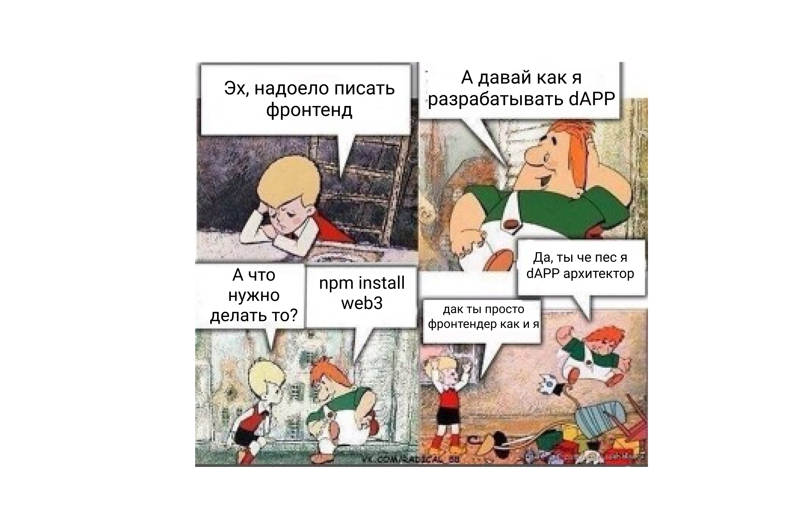

---
# Посмотрим как устроены dApp

---

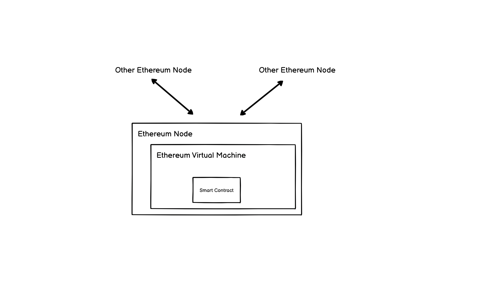

---

---

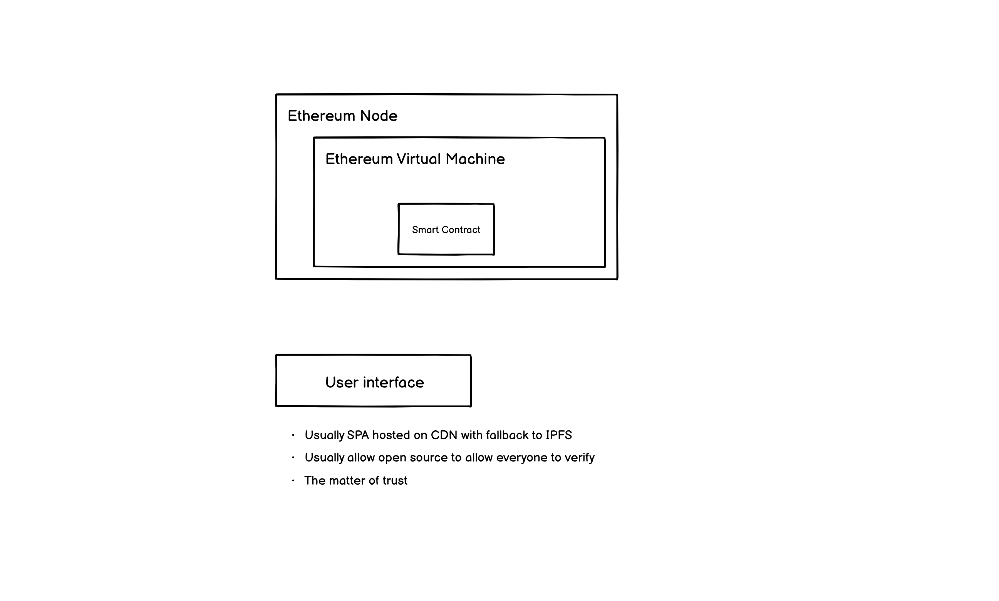

---

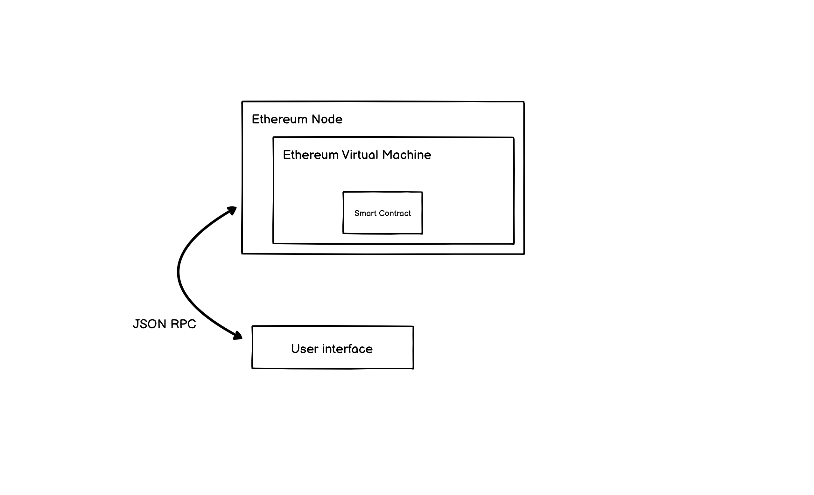

---

# 1) View режим
# До того как кошелек подключен

---
## 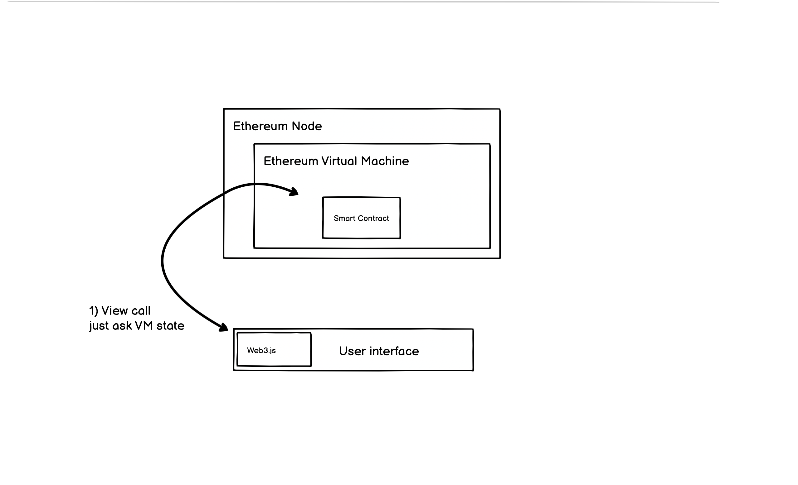

---

## 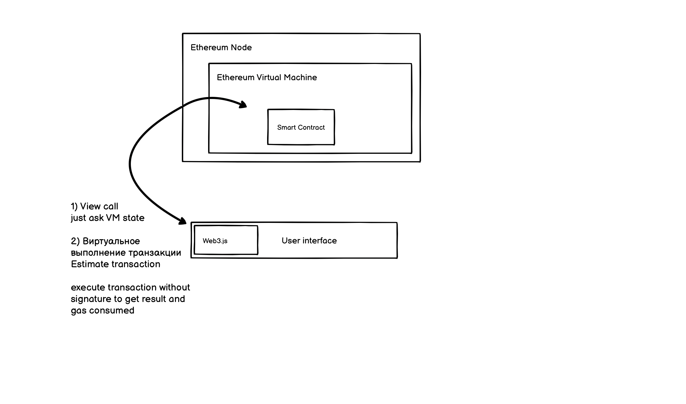

---
# 2) Write Режим 
# Когда кошелек подключен
---

## 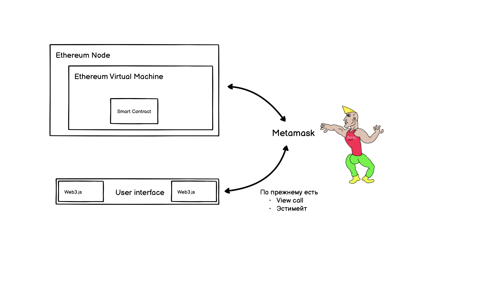

---

## 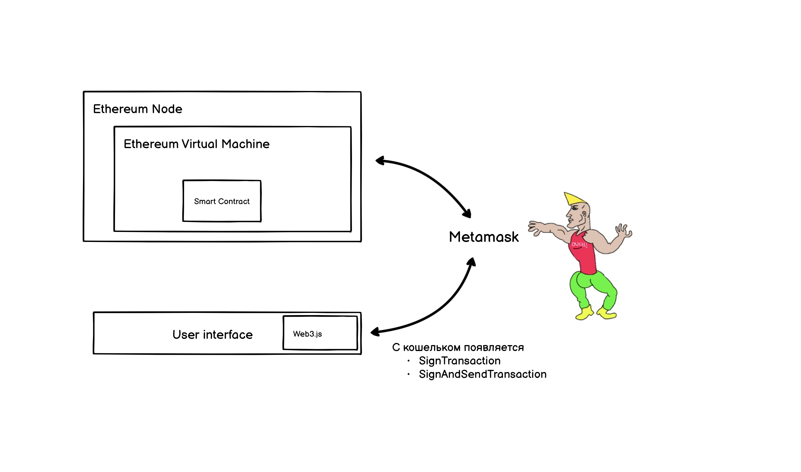

---
# 3) Режим Reallife
---
## - Много контрактов
## - Нужно составлять сложный байт код вызовов контрактов
## - Иногда нужно создавать новые контракты через фабрики
## - Много провайдеров кошельков
## - Появляется backend
## - Некоторые данные можно достать только через индексаторы
---

## 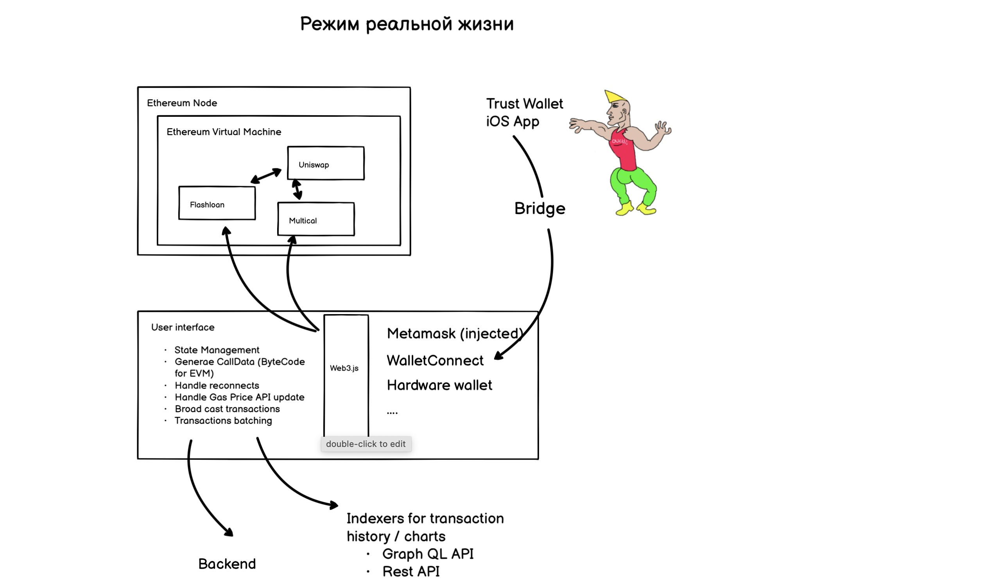

---
# 4) Режим Hardcore
---

## 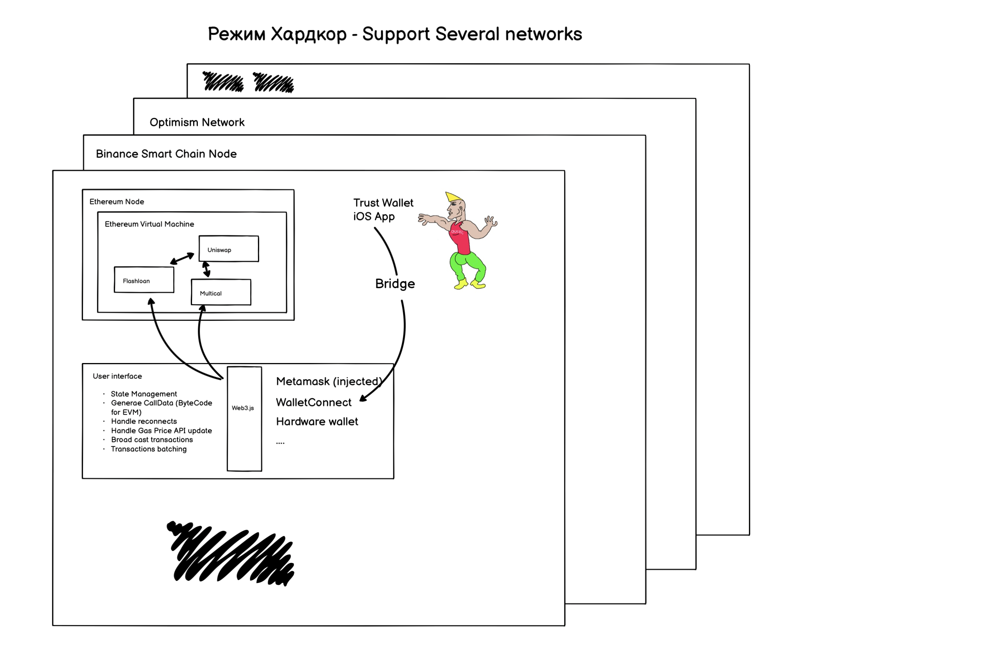

---

## 